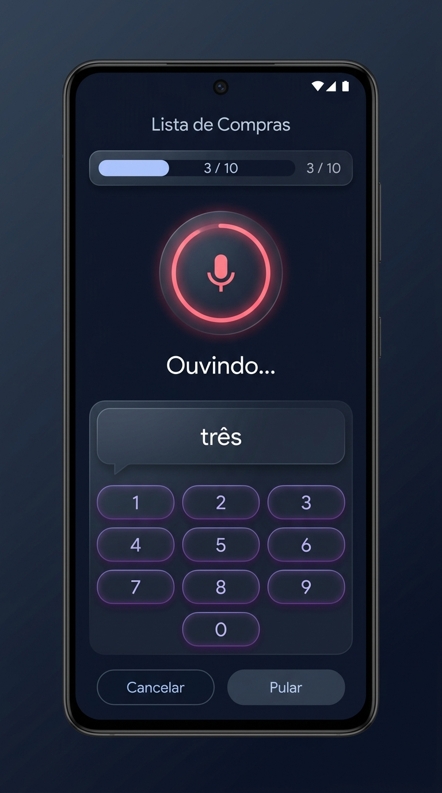
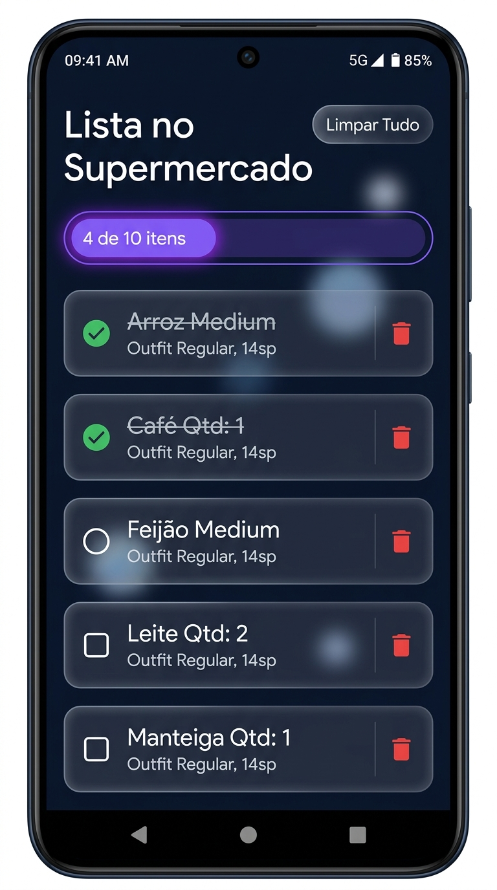
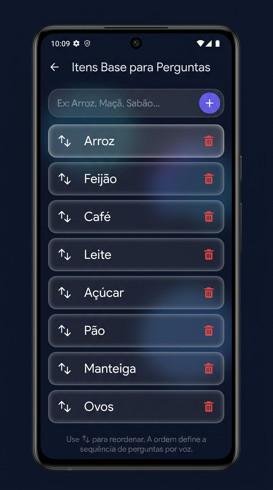

# 🛒 Lista de Compras Inteligente (PWA)

Um aplicativo web progressivo (PWA) e inteligente em português para gerenciar sua lista de compras por voz e toque, ideal para uso no celular durante as compras.

---

## 📸 Screenshots

Aqui estão as principais telas do aplicativo em funcionamento:

### 🎙️ 1. Assistente de Voz & Teclado
Controle por voz passo-a-passo para perguntar a quantidade de cada item na lista base, integrado com um teclado numérico rápido de dígito único e cancelamento instantâneo de voz.


### 🛒 2. Checklist do Supermercado
Lista final de compras com checkboxes interativos. Os itens já marcados/comprados são jogados automaticamente para o fim da lista, e ambos os grupos são ordenados alfabeticamente.


### ⚙️ 3. Configuração de Itens Base
Defina os itens iniciais a serem perguntados por voz e organize a ordem em que serão ditados usando os botões de subir (↑) e descer (↓).


---

## ✨ Funcionalidades Principais

- **Assistente de Voz com Loop de Captura Robustecido**: 
  - O app pergunta automaticamente `"Quanto [item]?"` utilizando a API de síntese de voz (`SpeechSynthesis`).
  - Escuta a resposta usando reconhecimento de voz (`SpeechRecognition`).
  - Se a resposta não for compreendida ou se o microfone falhar, o app emite um comando sonoro de `"Repita"` e continua ouvindo, sem travar ou exibir telas de erro complexas.
  - Aceita respostas numéricas faladas e mapeamentos fonéticos especiais em português (ex: **"uno"** vira `1`, **"doce"** vira `2` para evitar bugs comuns de transcrição rápida, além de **"meia"** para `6`, **"hum"** para `1`, etc.).
  - Aceita palavras negativas (**"não"**, **"nenhum"**, **"zero"**) para definir a quantidade como `0` e avançar.
- **Teclado Híbrido (Numpad) de Toque Único**:
  - Exibe um teclado numérico na tela durante a coleta.
  - Tocar em qualquer número (dígito único) interrompe a voz imediatamente (`window.speechSynthesis.cancel()`), cancela a escuta correspondente àquela pergunta e salva a quantidade direto, pulando para o próximo item.
- **Detector de Lista Ativa**:
  - Ao iniciar uma nova contagem, se o banco de dados já possuir itens ativos, o app avisa e pergunta se você deseja limpar e começar uma lista nova ou apenas complementar a existente.
- **Persistência Local Offline**:
  - Desenvolvido como PWA, funcionando 100% offline.
  - Dados salvos localmente com **IndexedDB** através da biblioteca **Dexie.js**.

---

## 🛠️ Tecnologias Utilizadas

- **Framework**: React + TypeScript + Vite
- **Banco de Dados**: IndexedDB (Dexie.js)
- **Voz**: Web Speech API (`SpeechSynthesis` & `SpeechRecognition`)
- **Estilos**: CSS Customizado Moderno (Tema escuro premium com estética *glassmorphism*)
- **Ícones**: Lucide React

---

## 🚀 Como Executar o Projeto Localmente

### Pré-requisitos
Certifique-se de ter o **Node.js** (versão 18+) instalado.

### Passos
1. Clone o repositório.
2. Na pasta do projeto, instale as dependências:
   ```bash
   npm install
   ```
3. Inicie o servidor de desenvolvimento:
   ```bash
   npm run dev
   ```
4. Acesse no navegador em `http://localhost:5173`.

---

## 📱 Como Carregar no Celular Android

A **Web Speech API** (reconhecimento de voz) exige um **Contexto Seguro** (Secure Context) para funcionar nos navegadores móveis (como o Chrome no celular). Isso significa que se você apenas abrir o IP local do seu computador (`http://192.168.1.XX:5173`) no celular, o microfone **não funcionará**.

Para testar no celular, escolha um dos métodos abaixo:

### Opção 1: USB Port Forwarding (Recomendado)
Este método faz o celular reconhecer o servidor do computador como `localhost`, liberando as permissões de microfone automaticamente.
1. Conecte o celular ao computador via cabo USB e ative a **Depuração USB** nas opções de desenvolvedor do Android.
2. No seu computador, abra o Google Chrome e acesse `chrome://inspect`.
3. Clique no botão **Port forwarding...**.
4. Configure a porta `5173` para apontar para `localhost:5173` e marque a opção **Enable port forwarding**.
5. No Google Chrome do celular, abra `http://localhost:5173`.

### Opção 2: Túnel HTTPS Seguro (Localtunnel / Ngrok)
Gere um link temporário público sob protocolo HTTPS.
1. No terminal do computador, execute:
   ```bash
   npx localtunnel --port 5173
   ```
2. Acesse o link `https://...localtunnel.me` gerado no navegador do celular.
